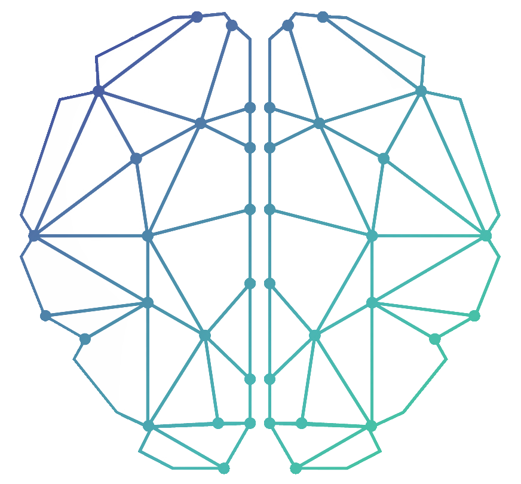

<p align="center">
    
</p>

<h1 align="center">OTTOMH: A Party-Thinking Game for The Web</h1>

OTTOMH (On The Top Of My Head) is a web-based party trivia game that challenges players to come up with as many words that start with a certain letter and belong to a certain category in a set amount of time while competing against other players.

Unlike physical board games, OTTOMH is easier to setup and can be played by geographically distributed players. It also provides a user-friendly, web-based experience similar to the popular board game Scattegories, allowing players to exercise their brains while having a good time.

Play the game here: https://ottomh.herokuapp.com/

## How to play

<p float="left">
    
    
    
    
    
</p>

* Invite people! Create a new lobby, copy the lobby code, and send it to your teammates.
* You have 60 seconds to submit as many words as you can think of at top of your head that begins with the given letter and matches the given category!
* Compete against time and other players! Words can only be submitted ONCE, and the first person takes the credit for it.
* Vote off words that don't match and earn points for the words that make it through the round!
* View players' scores and rankings on the scoreboard at the end of each round!
* Replay the game with the same people!

## Contributing

### Installing

You can either clone the repo or get download the source code from the release page.

To clone the repo:
```bash
git clone https://github.com/cis3296f22/ottomh.git
```

### Building

To run the project:

1. Install NPM packages with `npm install`.
2. Bundle JS code with `npm run build`.
3. Install Go packages with `go get`.
4. Run the server with `go run server.go`.
5. Go to [localhost:8080](http://localhost:8080/)

By default, the server listens on port 8080. If you would like to use another port, set the $PORT environment variable.

### Running Tests

[tests.sh](tests.sh) tests the backend with coverage and tests the frontend with coverage using a variety of third-party tools. To run these tests locally you will need to take a few extra steps:
1. Install [go-test-report](https://github.com/vakenbolt/go-test-report) with `go install github.com/vakenbolt/go-test-report@latest`. Make sure to add your GOPATH to the PATH (usually the GOPATH is `~/go/bin`)
2. [Line 3](tests.sh) of tests.sh is configured to open an HTML file in the Brave Browser using Mac's `open` command. You will have to edit this line if you are on a platform other than Mac.
3. The `time_picked` at [src/components/LobbyPage/LobbyPage.js](src/components/LobbyPage/LobbyPage.js) should be set to a very small value, like `"00:03"`.

### Generating Documentation

To generate documentation for the backend, start by installing godoc by running `go install golang.org/x/tools/cmd/godoc@latest`. Then go to the application root, and run `godoc -http=:6060`. You can then visit the go docs at localhost:6060. Here, search for the section labeled "ottomh".

To generate documentation for the frontend, use the jsdoc tool. Use `npm i jsdoc --save-dev` to install jsdoc. To generate documentation for the frontend, use `jsdoc -r src`. Then you can view the documentation by opening `out/index.html`.

## Credits
* [Brain image](src/images/logo.png) by [yo_han](https://www.freepik.com/free-vector/abstract-brain-background-design_1016468.htm#query=brain&position=17&from_view=search&track=sph%22%3E) on Freepik
